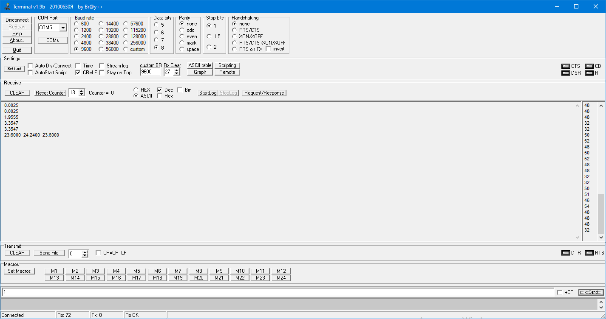

== Работа с UART в IAR Embedded Workbench

= *Ход работы:*

Для начала нам потребовалось подключить *USART* к источнику тактирования. Для этого мы
устанавливаем бит
*USART2EN* в регистре *APB1ENR*.

[source, cpp]
----
 RCC::APB1ENR::USART2EN::Enable::Set();
----

Далее необходимо сконфигурировать порты. То есть следует настроить порты на альтернативную
функцию нужного модуля USART​:

[source, cpp]
----
  GPIOA::MODER::MODER3::Alternate::Set();
  GPIOA::MODER::MODER2::Alternate::Set();
  GPIOA::AFRL::AFRL3::Af7::Set();
  GPIOA::AFRL::AFRL2::Af7::Set();
----

Первыми двумя строками мы настраиваем порты на альтернативную
функцию, а остальными - настраиваем саму альтернативную функцию, то есть настраиваем порты *A2* и *A3*
как *RX* и *TX*.

Далее настраиваем порты в режим *Push-Pull*(двухтактный выход) + *Pull Up*(подтяжка к 1)​

[source, cpp]
----
  GPIOA::PUPDR::PUPDR2::NoPullUpNoPullDown::Set();
  GPIOA::PUPDR::PUPDR3::PullUp::Set();
----

Производим работу с регистром управления *CR1*, устанавливаем режим дискретизации, длину символа, один стоп и один старт бит:

[source, cpp]
----
  USART2::CR1::OVER8::Value0::Set();
  USART2::CR1::M::Value0::Set();
  USART2::CR2::STOP::Value0::Set();
  USART2::CR1::PCE::Value0::Set();
----

Разрешаем глобальное прерывание по USART​ и прерывание по приему:

[source, cpp]
----
  NVIC::ISER1::Write(1<<6);
  USART2::CR1::RXNEIE::Value1::Set();
----

А также устанавливаем скорость передачи данных 9600 бит/c:

[source, cpp]
----
  uint32_t USART_DIV=16'000'000/(BaudRate*8*(2 - USART2::CR1::OVER8::Get()));
  USART2::BRR::DIV_Mantissa::Set(USART_DIV);
----

Разрешаем передачу помощью бита
*TE* и если надо прием, с помощью бита *RE* в модуле *USART* с помощью регистра *CR1​*:

[source, cpp]
----
  USART2::CR1::TE::Value1::Set();
  USART2::CR1::RE::Value1::Set();
----

В обработчике прерываний записываем следующий код:

[source, cpp]
----
static void Usart2InterruptHandler()
  {
    double sendValue = ledsIndicator.GetDispValue();
    char TBuff[200];
    sprintf(TBuff," %3.4f \n",sendValue);

    static const uint16_t size = std::strlen(TBuff);
    static char buff;
    buff = USART2::DR::Get();
    for(int k =0; k<size; k++)
    {
      USART2::DR::Write(TBuff[k]);
      while(!USART2::SR::TXE::Value1::IsSet())
      {
      }
    }
  }
----
Данный код преобразует полученные данные в удобную для восприятия форму программой *Terminal*, а также
осуществляет передачу данных при приеме данных от программы *Terminal*. Выводятся значения напряжения и
температуры.

Работа программы представлена ниже:

.Программа в действии

Код программы:

[source, cpp]
----
main.cpp

#include "gpioaregisters.hpp" //for Gpioa
#include "gpiocregisters.hpp" //for Gpioc
#include "gpiobregisters.hpp" //for Gpiob
#include "rccregisters.hpp"   //for RCC
#include "tim2registers.hpp"   //for SPI2
#include "nvicregisters.hpp"  //for NVIC
#include "ledsIndicator.h"
#include "Button.h"
#include "led.h"
#include "adc.h"
#include "usart2registers.hpp"
using namespace std ;

constexpr uint32_t BaudRate=9600;
extern "C"
{
int __low_level_init(void)
{
  RCC::AHB1ENR::GPIOAEN::Enable::Set();
  RCC::APB1ENR::USART2EN::Enable::Set();
  GPIOA::MODER::MODER3::Alternate::Set();
  GPIOA::MODER::MODER2::Alternate::Set();
  GPIOA::AFRL::AFRL3::Af7::Set();
  GPIOA::AFRL::AFRL2::Af7::Set();
  GPIOA::PUPDR::PUPDR2::NoPullUpNoPullDown::Set();
  GPIOA::PUPDR::PUPDR3::PullUp::Set();
  USART2::CR1::OVER8::Value0::Set();
  USART2::CR1::M::Value0::Set();
  USART2::CR2::STOP::Value0::Set();
  USART2::CR1::PCE::Value0::Set();
  USART2::CR1::TE::Value1::Set();
  USART2::CR1::RE::Value1::Set();
  NVIC::ISER1::Write(1<<6);
  //USART2::CR1::TXEIE::Value1::Set();
  USART2::CR1::RXNEIE::Value1::Set();

  uint32_t USART_DIV=16'000'000/(BaudRate*8*(2 - USART2::CR1::OVER8::Get()));
  USART2::BRR::DIV_Mantissa::Set(USART_DIV);

NVIC::ISER0::Write(1 << 28);
   return 1;
}
}

int main()
{
 adc1.Enable();
 ledsIndicator.Enable();
 ledsIndicator.Start();
 USART2::CR1::UE::Value1::Set();
  for(;;)
  {
    if(button.WasPressed())
    {
      flagIndicatorSwitch=!flagIndicatorSwitch;
    }
  }
}

----